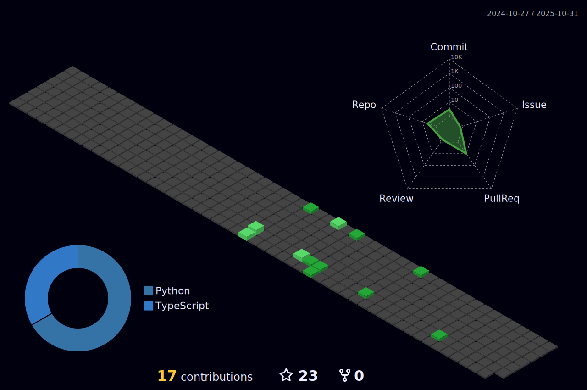

# Hello, I am BigM@x 👋

## About Me

I'm a passionate software developer with a diverse skill set in both web and mobile technologies. My goal is to create innovative and user-friendly applications that make a positive impact.

## Skills

- **Web Development:**
  - Frontend: HTML, CSS, JavaScript, React, Vue.js, TypeScript, Laravel-Vue.js, Angular.js
  - Backend: PHP, Laravel, Node.js, Express.js, MongoDB, MySQL, NoSQL
  - Responsive Design, UI/UX Development
  - Blockchain, Ethereum, Solidity, Smart Contact
  - Unity 2D and 3D game development

- **Mobile Development:**
  - Mobile App: Flutter (Dart), React Native
  - Cross-platform development, Native iOS and Android
  - RESTful APIs, Firebase

- **Version Control:**
  - Git, GitHub

- **Tools:**
  - VSCode, Android Studio
  - Unity
  - Postman, Insomnia

## Work Experience

### Software Engineer | [Adnet Solutions Limited] (2021.10 - 2022.09)

- Assessed and reviewed all pull requests created by other teammates to ensure the quality and accuracy of the code.
- I have been responsible for building both the frontend and backend for the web application as well as oversight onto technical decisions for the project.
- Integrated enhancements into web design to improve user stickiness, smooth functionality.
- Assisted backend developers with troubleshooting and problem solving.

### Laravel Developer | [Renodots and Kitchen Anapuruna] (2022.09 - 2023.08)

- Worked in a team environment using version control Github.
- II have been responsible for building both the frontend and backend for the web application as well as oversight onto technical decisions for the project with managing a team of 3 members.
- Managed data handling using AWS S3 bucket.

## Education

- **Bachelor of Science in Computer Science**
  - [LaSalle College Vancouver], [2018] - [2021]

## Certifications

- **Laravel Developer Certification**
  - [Certification Authority], [Year Earned]
- **React Developer Certification**
  - [Certification Authority], [Year Earned]
    
## Connect with Me

- GitHub: [[BigMax GitHub Profile](https://github.com/bigmax1018)]

Feel free to reach out if you have any questions or if you'd like to collaborate on exciting projects!
 
